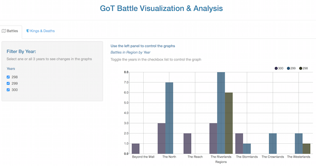

DDP Project: Game of Thrones Shiny App Battle visualization
========================================================
author: minitelle
date: Tue Jul 12 13:37:16 2016
autosize: true
font-family: 'Calibri'
 

Overview
========================================================

This presentation covers the final project of the `Developing Data Products` offered by Johns Hopkins Bloomberg School of Public Heath on Coursera.
For more details please visit: <https://www.coursera.org/learn/data-products>.

</img>

What's the App and what's in it?
========================================================

Shiny application visuzalizing some Game of Thonres data made available onn Kaggle
<http://kaggle.com>

- The Shiny app is based on 3 separate csv files that have been manipulated to make the data easier to visualize relying solely on rCharts ad the primary graphical package.

- Features also include reactive data inputs that allow for a user to dynamilcally change the data that gets displayed in the plots.

- Two tab sets, each with their own filter variables.

App Screenshot
========================================================

</img>

How to control Graphs in the app?
========================================================

- Click on either `battles` or `kings & deaths` tabs

***
- Use the side panel checkbox or drop down list

Where to access the app online?
========================================================

- Find the app online hosted on Shiny servers:

- All the codes used for the app can be found on github with details in addition to credits for the data source and hekpful sources which can also be found on the main app screen:
<https://github.com/minitelle/DP/tree/master/project>
